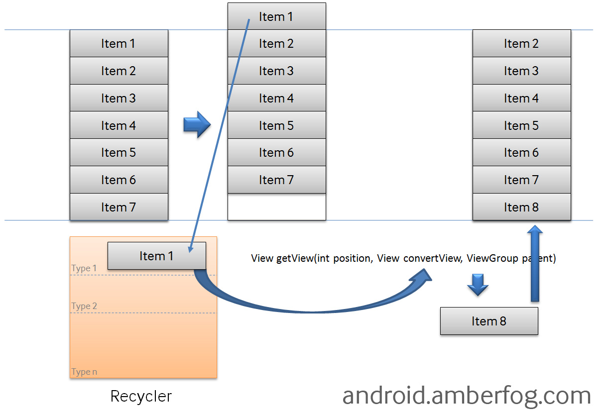

# ListView原理及优化

##原理

ListView的实现离不开Adapter。可以这么理解：ListView中给出了数据来的时候，View如何实现的具体方式，相当于MVC中的V；而Adapter提供了相当于MVC中的C，指挥了ListView的数据加载等行为。

提一个问题：假设ListView中有10W个条项，那内存中会缓存10W个吗？答案当然是否定的。那么是如何实现的呢？下面这张图可以清晰地解释其中的原理:

可以看到当一个View移出可视区域的时候，设为View1，它会被标记Recycle，然后可能：

  - 新进入的View2与View1类型相同，那么在getView方法传入的convertView就不是null而就是View1。换句话说，View1被重用了
  - 新进入的View2与View1类型不同，那么getView传入的convertView就是null，这是需要new一个View。当内存紧张时，View1就会被GC

## ListView的优化(以异步加载Bitmap优化为例)

首先概括的说ListView优化分为三级缓存:

  - 内存缓存
  - 文件缓存
  - 网络读取

简要概括就是在getView中，如果加载过一个图片，放入Map类型的一个MemoryCache中(示例代码使用的是Collections.synchronizedMap(new LinkedHashMap<String, Bitmap>(10, 1.5f, true))来维护一个试用LRU的堆)。如果这里获取不到，根据View被Recycle之前放入的TAG中记录的uri从文件系统中读取文件缓存。如果本地都找不到，再去网络中异步加载。

这里有几个注意的优化点：

  - 从文件系统中加载图片也没有内存中加载那么快，甚至可能内存中加载也不够快。因此在ListView中应设立busy标志位，当ListView滚动时busy设为true，停止各个view的图片加载。否则可能会让UI不够流畅用户体验度降低。
  - 文件加载图片放在子线程实现，否则快速滑动屏幕会卡
  - 开启网络访问等耗时操作需要开启新线程，应使用线程池避免资源浪费，最起码也要用AsyncTask。
  - Bitmap从网络下载下来最好先放到文件系统中缓存。这样一是方便下一次加载根据本地uri直接找到，二是如果Bitmap过大，从本地缓存可以方便的使用Option.inSampleSize配合Bitmap.decodeFile(ui, options)或Bitmap.createScaledBitmap来进行内存压缩
