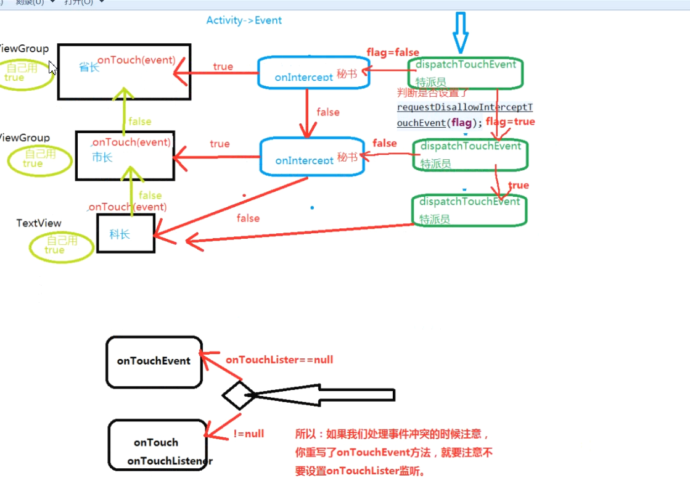

# 事件分发机制

事件的分发机制由三个重要方法来共同完成：dispatchTouchEvent、onInterceptTouchEvent和onTouchEvent

  - 事件分发：public boolean dispatchTouchEvent(MotionEvent ev)：用来进行事件的分发。如果事件能够传递给当前View，那么此方法一定会被调用，返回结果受当前View的onTouchEvent和下级View的DispatchTouchEvent方法的影响，表示是否消耗当前事件。

  - 事件拦截：public boolean onInterceptTouchEvent(MotionEvent event)：在上述方法内部调用，用来判断是否拦截某个事件，如果当前View拦截了某个事件，那么在同一个事件序列当中，此方法不会被再次调用，返回结果表示是否拦截当前事件。

  - 事件响应：public boolean onTouchEvent(MotionEvent event)：在dispatchTouchEvent方法中调用，用来处理点击事件，返回结果表示是否消耗当前事件，如果不消耗，则在同一个事件序列中，当前View无法再次接收到事件。

三者的关系可以总结为如下伪代码：

```
public boolean dispatchTouchEvent(MotionEvent ev) {
    boolean consume = false;
    if (onInterceptTouchEvent(ev)) {
        consume = onTouchEvent(ev);
    } else {
        consume = child.dispatchTouchEvent(ev);
    }

    return consume;
}
```

  - 同一个事件序列是从手指触摸屏幕的那一刻起，到手指离开屏幕那一刻结束，这个过程中所产生的一系列事件。这个事件序列以down事件开始，中间含有数量不定的move事件，最终以up事件结束。

  - 一个事件序列只能被一个View拦截且消耗，不过通过事件代理`TouchDelegate`，可以将`onTouchEvent`强行传递给其他View处理。

  - **某个View一旦决定拦截，那么这一事件序列就都只能由它来处理**。

  - **某个View一旦开始处理事件，如果不消耗ACTION_DOWN事件（onTouchEvent返回了false），那么事件会重新交给它的父元素处理，即父元素的onTouchEvent会被调用**。

  - 如果View不消耗除`ACTION_DOWN`以外的事件，那么这个点击事件会消失，此时父元素的`onTouchEvent`并不会调用，并且当前View可以持续收到后续的事件（Android系统通过一个标记来解决），最终这些消失的事件会传递到Activity。

  - `ViewGroup`默认不拦截任何事件。Android源码中`ViewGroup`的`onInterceptTouchEvent`方法默认返回false。

  - **View没有`onIntercepteTouchEvent`方法，一旦有点击事件传递给它，那么它的`onTouchEvent`方法就会被调用**。

  - View的`onTouchEvent`默认都不会消耗事件（返回false），除非它是可点击的（`clickable`和`longClickable`有一个为true）。View的`longClickable`默认都为false，clickable要分情况看，比如Button默认为true，TextView默认为false。

  - View的`enable`属性不影响`onTouchEvent`的默认返回值。哪怕一个View是`disable`状态，只要它的`clickable`或者`longClickable`有一个为true，那么它的`onTouchEvent`就返回true。

  - `onClick`会发生的前提是当前View是可点击的，并且它受到down和up的事件。

  - 事件传递是由外向内的，即事件总是先传递给父元素，然后再由父元素分发给子View，**通过`requestDisallowInterceptTouchEvent`方法就可以在子元素中干扰父元素的事件分发过程**，但ACTION_DOWN事件除外。

  
