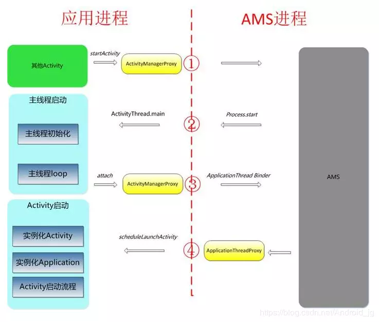

# 面试题

### APK安装过程

应用安装涉及到如下几个目录：
  - **system/app**：系统自带的应用程序，无法删除
  - **data/app**：用户程序安装的目录，有删除权限。安装时把apk文件复制到此目录
  - **data/data**：存放应用程序的数据
  - **data/dalvik-cache**：将apk中的dex文件安装到dalvik-cache目录下

复制APK安装包到data/app目录下，解压并扫描安装包，把dex文件(Dalvik字节码)保存到dalvik-cache目录，并在data/data目录下创建对应的应用数据目录。

***

### invalidate()和postInvalidate() 的区别

- `invalidate()`是用来刷新View的，必须是在UI线程中进行工作。比如在修改某个view的显示时，调用invalidate()才能看到重新绘制的界面。
- `postInvalidate()`在工作者线程中被调用。

***

### 导入外部数据库

Android系统下数据库应该存放在 `/data/data/com.*.*(package name)/` 目录下，所以我们需要做的是把已有的数据库传入那个目录下。操作方法是用`FileInputStream`读取原数据库，再用`FileOutputStream`把读取到的东西写入到那个目录。

***

### Parcelable和Serializable区别

`Parcelable`的性能比`Serializable`好，在内存开销方面较小，所以在内存间数据传输时推荐使用`Parcelable`，如activity间传输数据，而`Serializable`可将数据持久化方便保存，所以在需要保存或网络传输数据时选择`Serializable`，因为android不同版本`Parcelable`可能不同，所以不推荐使用`Parcelable`进行数据持久化。

`Serializable`序列化不保存静态变量，可以使用`Transient`关键字对部分字段不进行序列化，也可以覆盖`writeObject`、`readObject`方法以实现序列化过程自定义。

***

### Android里跨进程传递数据的几种方案

  - Binder
  - Socket/LocalSocket
  - 共享内存

***

### 匿名共享内存，使用场景

在Android系统中，提供了独特的匿名共享内存子系统`Ashmem(Anonymous Shared Memory)`，它以驱动程序的形式实现在内核空间中。它有两个特点，一是能够辅助内存管理系统来有效地管理不再使用的内存块，二是它通过Binder进程间通信机制来实现进程间的内存共享。

`ashmem`并像`Binder`是Android重新自己搞的一套东西，而是利用了Linux的 **tmpfs文件系统**。tmpfs是一种可以基于RAM或是SWAP的高速文件系统，然后可以拿它来实现不同进程间的内存共享。

大致思路和流程是：

  - Proc A 通过 tmpfs 创建一块共享区域，得到这块区域的 fd（文件描述符）
  - Proc A 在 fd 上 mmap 一片内存区域到本进程用于共享数据
  - Proc A 通过某种方法把 fd 倒腾给 Proc B
  - Proc B 在接到的 fd 上同样 mmap 相同的区域到本进程
  - 然后 A、B 在 mmap 到本进程中的内存中读、写，对方都能看到了

其实核心点就是 **创建一块共享区域，然后2个进程同时把这片区域 mmap 到本进程，然后读写就像本进程的内存一样**。这里要解释下第3步，为什么要倒腾 fd，因为在 linux 中 fd 只是对本进程是唯一的，在 Proc A 中打开一个文件得到一个 fd，但是把这个打开的 fd 直接放到 Proc B 中，Proc B 是无法直接使用的。但是文件是唯一的，就是说一个文件（file）可以被打开多次，每打开一次就有一个 fd（文件描述符），所以对于同一个文件来说，需要某种转化，把 Proc A 中的 fd 转化成 Proc B 中的 fd。这样 Proc B 才能通过 fd mmap 同样的共享内存文件。

使用场景：进程间大量数据传输。

***

### ContentProvider实现原理

ContentProvider 有以下两个特点：

  - **封装**：对数据进行封装，提供统一的接口，使用者完全不必关心这些数据是在DB，XML、Preferences或者网络请求来的。当项目需求要改变数据来源时，使用我们的地方完全不需要修改。
  - **提供一种跨进程数据共享的方式**。

`Content Provider`组件在不同应用程序之间传输数据是基于匿名共享内存机制来实现的。其主要的调用过程：

1. 通过ContentResolver先查找对应给定Uri的ContentProvider，返回对应的`BinderProxy`

  - 如果该Provider尚未被调用进程使用过:
    - 通过`ServiceManager`查找activity service得到`ActivityManagerService`对应`BinderProxy`
    - 调用`BinderProxy`的transcat方法发送`GET_CONTENT_PROVIDER_TRANSACTION`命令，得到对应`ContentProvider`的`BinderProxy`。

  - 如果该Provider已被调用进程使用过，则调用进程会保留使用过provider的HashMap。此时直接从此表查询即得。

2. 调用`BinderProxy`的`query()`

***

### 如何使用ContentProvider进行批量操作？

通常进行数据的批量操作我们都会使用“事务”，但是`ContentProvider`如何进行批量操作呢？创建 `ContentProviderOperation` 对象数组，然后使用 `ContentResolver.applyBatch()` 将其分派给内容提供程序。您需将内容提供程序的授权传递给此方法，而不是特定内容 `URI`。这样可使数组中的每个 `ContentProviderOperation` 对象都能适用于其他表。调用 `ContentResolver.applyBatch()` 会返回结果数组。

同时我们还可以通过`ContentObserver`对数据进行观察：

  1. 创建我们特定的`ContentObserver`派生类，必须重载`onChange()`方法去处理回调后的功能实现
  2. 利用`context.getContentResolover()`获得`ContentResolove`对象，接着调用`registerContentObserver()`方法去注册内容观察者，为指定的Uri注册一个`ContentObserver`派生类实例，当给定的Uri发生改变时，回调该实例对象去处理。
  3. 由于`ContentObserver`的生命周期不同步于Activity和Service等，因此，在不需要时，需要手动的调用`unregisterContentObserver()`去取消注册。

***

### Application类的作用

 Android系统会为每个程序运行时创建一个`Application`类的对象且仅创建一个，所以Application可以说是单例 (singleton)模式的一个类。`Application`对象的生命周期是整个程序中最长的，它的生命周期就等于这个程序的生命周期。因为它是全局的单例的，所以在不同的`Activity`,`Service`中获得的对象都是同一个对象。所以通过`Application`来进行一些，数据传递，数据共享，数据缓存等操作。

***

### 广播注册后不解除注册会有什么问题？(内存泄露)

我们可以通过两种方式注册`BroadcastReceiver`，一是在Activity启动过程中通过代码动态注册，二是在AndroidManifest.xml文件中利用`<receiver>`标签进行静态注册。

  - 对于第一种方法，我们需要养成一个良好的习惯：在Activity进入停止或者销毁状态的时候使用`unregisterReceiver`方法将注册的`BroadcastReceiver`注销掉。
  - 对于`<receiver>`标签进行注册的，那么该对象的实例在`onReceive`被调用之后就会在任意时间内被销毁。

***

### 属性动画(Property Animation)和补间动画(Tween Animation)的区别

  - 补间动画只是针对于View，超脱了View就无法操作了。
  - 补间动画有四种动画操作（移动，缩放，旋转，淡入淡出）。
  - 补间动画只是改变View的显示效果而已，但是不会真正的去改变View的属性。
  - 属性动画改变View的实际属性值，当然它也可以不作用于View。

***

### BrocastReceive里面可不可以执行耗时操作?

不能，当 `onReceive()` 方法在 10 秒内没有执行完毕，Android 会认为该程序无响应，所以在`BroadcastReceiver`里不能做一些比较耗时的操作，否侧会弹出 ANR 的对话框。

***

### Android优化工具

#### TraceView

traceview 是Android SDK中自带的一个工具，可以 **对应用中方法调用耗时进行统计分析，是Android性能优化和分析时一个很重要的工具**。使用方法：第一种是在相应进行traceview分析的开始位置和结束位置分别调用`startMethodTracing`和`stopMethodTracing`方法。第二种是在ddms中直接使用，即在ddms中在选中某个要进行监控的进程后，点击如图所示的小图标开始监控，在监控结束时再次点击小图标，ddms会自动打开traceview视图。

#### Systrace

Systrace是Android4.1中新增的性能数据采样和分析工具。它可帮助开发者收集Android关键子系统（如`surfaceflinger`、`WindowManagerService`等Framework部分关键模块、服务）的运行信息，从而帮助开发者更直观的分析系统瓶颈，改进性能。

Systrace的功能包括跟踪系统的I/O操作、内核工作队列、CPU负载以及Android各个子系统的运行状况等。

***

### Dalvik与ART的区别？

Dalvik是Google公司自己设计用于Android平台的Java虚拟机。Dalvik虚拟机是Google等厂商合作开发的Android移动设备平台的核心组成部分之一，它可以支持已转换为.dex(即Dalvik Executable)格式的Java应用程序的运行，.dex格式是专为Dalvik应用设计的一种压缩格式，适合内存和处理器速度有限的系统。Dalvik经过优化，允许在有限的内存中同时运行多个虚拟机的实例，并且每一个Dalvik应用作为独立的Linux进程执行。独立的进程可以防止在虚拟机崩溃的时候所有程序都被关闭。

ART代表`Android Runtime`,其处理应用程序执行的方式完全不同于Dalvik，**Dalvik是依靠一个Just-In-Time(JIT)编译器去解释字节码。开发者编译后的应用代码需要通过一个解释器在用户的设备上运行，这一机制并不高效，但让应用能更容易在不同硬件和架构上运行。ART则完全改变了这套做法，在应用安装的时候就预编译字节码到机器语言，这一机制叫 Ahead-Of-Time(AOT) 编译** 。在移除解释代码这一过程后，应用程序执行将更有效率，启动更快。

ART优点：

  1. 系统性能的显著提升
  2. 应用启动更快、运行更快、体验更流畅、触感反馈更及时
  3. 更长的电池续航能力
  4. 支持更低的硬件

ART缺点：

  1. 更大的存储空间占用，可能会增加10%-20%
  2. 更长的应用安装时间

***

### Android动态权限？

Android 6.0 动态权限，这里以拨打电话的权限为例，首先需要在Manifest里添加`android.permission.CALL_PHONE`权限。

```
int checkCallPhonePermission = ContextCompat.checkSelfPermission(this, Manifest.permission.CALL_PHONE);
    if (checkCallPhonePermission != PackageManager.PERMISSION_GRANTED) {
        ActivityCompat.requestPermissions(
                this, new String[]{Manifest.permission.CALL_PHONE}, REQUEST_CODE_ASK_CALL_PHONE);
        return;
    }
```

在获取权限后，可以重写Activity.onRequestPermissionsResult方法来进行回调。

```
@Override
public void onRequestPermissionsResult(int requestCode, @NonNull String[] permissions,
                                       @NonNull int[] grantResults) {
    switch (requestCode) {
        case REQUEST_CODE_ASK_CALL_PHONE:
            if (grantResults[0] == PackageManager.PERMISSION_GRANTED) {
                // Permission Granted
                Toast.makeText(MainActivity.this, "CALL_PHONE Granted", Toast.LENGTH_SHORT)
                        .show();
            } else {
                // Permission Denied
                Toast.makeText(MainActivity.this, "CALL_PHONE Denied", Toast.LENGTH_SHORT)
                        .show();
            }
            break;
        default:
            super.onRequestPermissionsResult(requestCode, permissions, grantResults);
    }
}
```

***

### ViewPager如何判断左右滑动？

实现`OnPageChangeListener`并重写`onPageScrolled`方法，通过参数进行判断。

***

### ListView与RecyclerView

  1. **ViewHolder**：在ListView中，ViewHolder需要自己来定义，且这只是一种推荐的使用方式，不使用当然也可以，这不是必须的。而在RecyclerView中使用 `RecyclerView.ViewHolder` 则变成了必须，尽管实现起来稍显复杂，但它却解决了ListView面临的上述不使用自定义ViewHolder时所面临的问题。

  2. **LayoutManager**：RecyclerView提供了更加丰富的布局管理。`LinearLayoutManager`，可以支持水平和竖直方向上滚动的列表。`StaggeredGridLayoutManager`，可以支持交叉网格风格的列表，类似于瀑布流或者Pinterest。`GridLayoutManager`，支持网格展示，可以水平或者竖直滚动，如展示图片的画廊。

  3. **ItemAnimator**：相比较于ListView，`RecyclerView.ItemAnimator` 则被提供用于在`RecyclerView`添加、删除或移动item时处理动画效果。

  4. **ItemDecoration**：RecyclerView在默认情况下并不在item之间展示间隔符。如果你想要添加间隔符，你必须使用`RecyclerView.ItemDecoration`类来实现。

ListView可以设置选择模式，并添加`MultiChoiceModeListener`，`RecyclerView`中并没有提供这样功能。

***

### SpannableString

TextView通常用来显示普通文本，但是有时候需要对其中某些文本进行样式、事件方面的设置。Android系统通过`SpannableString`类来对指定文本进行相关处理。可以通过`SpannableString`来对TextView进行富文本设置，包括但不限于文本颜色，删除线，图片，超链接，字体样式。

***

### 描述一下Android手机启动过程和App启动过程？

#### Android手机启动过程

当我们开机时，首先是启动Linux内核，在Linux内核中首先启动的是init进程，这个进程会去读取配置文件`system\core\rootdir\init.rc`配置文件，这个文件中配置了Android系统中第一个进程Zygote进程。

启动Zygote进程 --> 创建AppRuntime（Android运行环境） --> 启动虚拟机 --> 在虚拟机中注册JNI方法 --> 初始化进程通信使用的Socket（用于接收AMS的请求） --> 启动系统服务进程 --> 初始化时区、键盘布局等通用信息 --> 启动Binder线程池 --> 初始化系统服务（包括PMS，AMS等等） --> 启动Launcher

#### App启动过程



  1. 应用的启动是从其他应用调用`startActivity`开始的。通过代理请求AMS启动Activity。

  2. AMS创建进程，并进入`ActivityThread`的main入口。在main入口，主线程初始化，并loop起来。主线程初始化，主要是实例化`ActivityThread`和`ApplicationThread`，以及`MainLooper`的创建。`ActivityThread`和`ApplicationThread`实例用于与AMS进程通信。

  3. 应用进程将实例化的`ApplicationThread`，`Binder`传递给AMS，这样AMS就可以通过代理对应用进程进行访问。

  4. AMS通过代理，请求启动Activity。`ApplicationThread`通知主线程执行该请求。然后，`ActivityThread`执行Activity的启动。

  5. Activity的启动包括，Activity的实例化，Application的实例化，以及Activity的启动流程：create、start、resume。


可以看到 **入口Activity其实是先于Application实例化，只是onCreate之类的流程，先于Activity的流程**。另外需要`scheduleLaunchActivity`，在`ApplicationThreaad`中，对应AMS管理Activity生命周期的方法都以`scheduleXXXActivity`，ApplicationThread在Binder线程中，它会向主线程发送消息，ActivityThread的Handler会调用相应的handleXXXActivity方法，然后会执行performXXXActivity方法，最终调用Activity的onXXX方法

***

### Include、Merge、ViewStub的作用

**Include**：布局重用

  - `<include />`标签可以使用单独的layout属性，这个也是必须使用的。

  - 可以使用其他属性。`<include />`标签若指定了ID属性，而你的layout也定义了ID，则你的layout的ID会被覆盖，解决方案。

  - 在`<include />`标签中所有的`android:layout_*`都是有效的，**前提是必须要写layout_width和layout_height两个属性**。

  - 布局中可以包含两个相同的include标签

**Merge**：减少视图层级，多用于替换FrameLayout或者当一个布局包含另一个时，`<merge/>`标签消除视图层次结构中多余的视图组。

>例如：你的主布局文件是垂直布局，引入了一个垂直布局的include，这是如果include布局使用的LinearLayout就没意义了，使用的话反而减慢你的UI表现。这时可以使用<merge/>标签优化。

**ViewStub**：需要时使用。优点是当你需要时才会加载，使用他并不会影响UI初始化时的性能。需要使用时调用`inflate()`。

***

### Asset目录与res目录的区别

  - **assets 目录**：不会在`R.java`文件下生成相应的标记，assets文件夹可以自己创建文件夹，必须使用`AssetsManager`类进行访问，存放到这里的资源在运行打包的时候都会打入程序安装包中，

  - **res 目录**：会在R.java文件下生成标记，这里的资源会在运行打包操作的时候判断哪些被使用到了，没有被使用到的文件资源是不会打包到安装包中的。

> res/raw 和 assets文件夹来存放不需要系统编译成二进制的文件，例如字体文件等

> res/raw不可以有目录结构，而assets则可以有目录结构，也就是assets目录下可以再建立文件夹

***

### System.gc && Runtime.gc

`System.gc`和`Runtime.gc`是等效的，在`System.gc`内部也是调用的`Runtime.gc`。**调用两者都是通知虚拟机要进行gc，但是否立即回收还是延迟回收由JVM决定**。两者唯一的区别就是一个是类方法，一个是实例方法。

***

### Application 在多进程下会多次调用 onCreate() 么？

当采用多进程的时候，比如下面的Service 配置：

```XML
<service
    android:name=".MyService"
    android:enabled="true"
    android:exported="false"
    android:process=":remote" />
```

> android:process 属性中 `:`的作用就是把这个名字附加到你的包所运行的标准进程名字的后面作为新的进程名称。

这样配置会调用 onCreate() 两次。

***

### Theme && Style

  - **Style** 是一组外观、样式的属性集合，适用于 View 和 Window 。

  - **Theme** 是一种应用于整个 Activity 或者 Application ，而不是独立的 View。

***

### SQLiteOpenHelper.onCreate() 调用时机？

在调`getReadableDatabase`或`getWritableDatabase`时，会判断指定的数据库是否存在，不存在则调`SQLiteDatabase.onCreate`创建， `onCreate`只在数据库第一次创建时才执行。

***

### Removecallback 失效？

Removecallback 必须是同一个Handler才能移除。

***

### Toast 如果会短时间内频繁显示怎么优化？

```
public void update(String msg){
  toast.setText(msg);
  toast.show();
}
```

***

### Notification 如何优化？

可以通过 相同 ID 来更新 Notification 。

***

### 应用怎么判断自己是处于前台还是后台？

主要是通过 `getRunningAppProcesses()` 方法来实现。

```
ActivityManager activityManager = (ActivityManager) getSystemService(Context.ACTIVITY_SERVICE);
List<ActivityManager.RunningAppProcessInfo> appProcesses = activityManager.getRunningAppProcesses();
for (ActivityManager.RunningAppProcessInfo appProcess : appProcesses) {
    if (appProcess.processName.equals(getPackageName())) {
        if (appProcess.importance == ActivityManager.RunningAppProcessInfo.IMPORTANCE_FOREGROUND) {
            Log.d(TAG, String.format("Foreground App:%s", appProcess.processName));
        } else {
            Log.d(TAG, "Background App:" + appProcess.processName);
        }
    }
}
```

***

### FragmentPagerAdapter 和 FragmentStateAdapter 的区别？

`FragmentStatePagerAdapter` 是 `PagerAdapter` 的子类，这个适配器对实现多个 `Fragment` 界面的滑动是非常有用的，它的工作方式和listview是非常相似的。当Fragment对用户不可见的时候，整个Fragment会被销毁，只会保存Fragment的保存状态。基于这样的特性，`FragmentStatePagerAdapter` 比 `FragmentPagerAdapter` 更适合用于很多界面之间的转换，而且消耗更少的内存资源。

***

### Bitmap的本质？

本质是 SkBitmap 详见 Pocket

安卓使用的2D图形引擎skia

***

### SurfaceView && View && GLSurfaceView

  - `View`：显示视图，内置画布，提供图形绘制函数、触屏事件、按键事件函数等；**必须在UI主线程内更新画面，速度较慢**。

  - `SurfaceView`：基于view视图进行拓展的视图类，更适合2D游戏的开发；**View的子类，类似使用双缓机制，在新的线程（也可以在UI线程）中更新画面所以刷新界面速度比 View 快**，但是会涉及到线程同步问题。
- `GLSurfaceView`：openGL专用。基于SurfaceView视图再次进行拓展的视图类，**专用于3D游戏开发的视图**。
